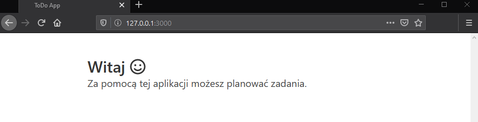

# Tworzenie szkieletu aplikacji

W tej części kursu zaimplementujesz szkielet aplikacji w Node.js oparty o bibliotekę koa i kilka dodatkowych modułów.

## Wprowadzenie
Node.js to otwarto źródłowe i międzyplatformowe środowisko uruchomieniowe dla języka JavaScript. Oparte jest o silnik wykonywania kodu JavaScript o nazwie V8, który stanowi fundament przeglądarki Google Chrome. Node.js umożliwia pisanie w JavaScript aplikacji działających w różnych środowiskach i na różnych architekturach sprzętowych. Udostępnia również interfejsy programistyczne dla języka JavaScript do wykonywania operacji na plikach, komunikacji sieciowej, kryptografii, itd. Funkcjonalności te udostępniane są za pomocą tzw. bindings, czyli interfejsów do bibliotek napisanych w innych językach programowania, np. C lub C++.

Node.js został zaprojektowany z myślą o tworzeniu wydajnych aplikacji sieciowych, nie wymagając przy tym od programisty wiedzy z zakresu wielowątkowości. Architektura Node.js opiera się na pętli zdarzeń i wykorzystaniu mechanizmów asynchronicznego wejścia-wyjścia systemu operacyjnego (ang. async I/O), zamiast na tworzeniu ogromnej liczby wątków, jak ma to miejsce w innych technologiach. Implementacja tych mechanizmów znajduje się w bibliotece *libuv*.

### Uruchamianie Node.js
Po zainstalowaniu Node.js w systemie dostępne jest polecenie `node`. Wywołane bez parametrów spowoduje uruchomienie interpretera języka JavaScript w trybie interaktywnym (REPL). Podanie nazwy pliku jako argumentu spowoduje wykonanie kodu zawartego w tym pliku przez interpreter języka JavaScript:

```sh
node app.js
```

### Pierwsza aplikacja w Node.js
Poniższy przykład przedstawia implementację serwera opartą o moduł `http`. Moduł `http` jest wbudowanym w Node.js co oznacza, że nie wymaga on osobnej instalacji. Serwer nasłuchuje na porcie `3000` i na każde żądanie odpowiada komunikatem `Hello World`.

```js
// Importuje moduł http.
const http = require('http')

// Tworzy instancję serwera.
const server = http.createServer((req, res) => {
  // Konstruuje i wysyła odpowiedź do klienta.
  res.statusCode = 200;
  res.setHeader('Content-Type', 'text/plain')
  res.end('Hello World')
})

// Uruchamia serwer nasłuchujący na porcie 3000.
server.listen(3000)
```

Pierwszą rzeczą, którą należy zrobić aby skorzystać z dowolnego modułu to jego zaimportowanie. Do importowania modułów w Node.js służy funkcja `require`. W powyższej implementacji importujemy moduł `http` i zapisujemy go w zmiennej o tej samej nazwie, co umożliwia odwoływanie się do tego modułu w kodzie.

W kolejnych linijkach utworzony zostaje serwer metodą `createServer` modułu `http`. Metoda ta przyjmuje argument w postaci funkcji, która zostanie wywołana w momencie otrzymania żądania. Funkcja ta przyjmuje dwa argumenty: `req` jest to obiekt reprezentujący żądanie klienta, `res` jest to obiekt reprezentujący odpowiedź serwera. Uruchomienie i rozpoczęcie nasłuchiwania przez serwer znajduje się w ostatniej linijce. Pierwszy argument metody `listen` to numer portu, na którym serwer będzie nasłuchiwał.

Aby uruchomić powyższą implementację serwera należy zapisać jego kod w pliku z roszerzeniem .js i wywołać polecenie `node <nazwa-pliku>.js`. Działanie serwera można przetestować przechodząc w przeglądarce internetowej pod adres [http://127.0.0.1:3000](http://127.0.0.1:3000).

Dodatkowe materiały:

* [Przewodniki Node.js](https://nodejs.org/en/docs/guides)
* [Dokumentacja modułów Node.js w tym http](https://nodejs.org/api)
* [Wprowadzenie do architektury klient-server](https://developer.mozilla.org/en-US/docs/Learn/Server-side/First_steps/Client-Server_overview)
* [Wprowadzenie do protokołu HTTP](https://developer.mozilla.org/en-US/docs/Web/HTTP/Overview)

### Aplikacja koa
Tworzenie aplikacji internetowej korzystając z modułu `http` wymagałoby znacznych nakładów pracy. Istnieje wiele bibliotek pomocnych w tworzeniu rozbudowanych aplikacji internetowych, a jedną z najpopularniejszych jest *koa*. Aplikacja napisana z wykorzystaniem koa wygląda następująco:

```js
// Importuje moduł koa.
const Koa = require('koa')

// Tworzy instancję aplikacji.
const app = new Koa()

// Dodaje funkcję, która zostanie wywołana po otrzymaniu żądania od klienta.
app.use(async (ctx) => {
  // Ustawia odpowiedź serwera.
  ctx.body = 'Hello World'
})

// Uruchamia serwer nasłuchujący na porcie 3000
app.listen(3000)
```

Podobnie jak w przypadku aplikacji korzystającej z modułu `http`, niezbędne jest zaimportowanie modułu `koa`. Kolejnym krokiem jest utworzenie instancji aplikacji korzystając z konstruktora. Aplikacja koa to obiekt zawierający tablicę tzw. funkcji middleware (ang. middleware functions), które są wykonywane w kolejności dodania w momencie otrzymania przez aplikację żądania od klienta. Funkcje middleware dodaje się do aplikacji metodą `use` obiektu aplikacji. W powyższym przykładzie została dodana tylko jedna funkcja, która na każde żądanie odpowiada komunikatem `Hello World`.

Kolejną biblioteką ułatwiającą tworzenie aplikacji internetowych jest `koa-router`. Jest to funkcja middleware udostępniająca mechanizm trasowania dla aplikacji. Pojęcie to najlepiej zobrazować przykładem:

```js
// Importuje moduł koa.
const Koa = require('koa')

// Importuje moduł koa-router.
const Router = require('@koa/router')

// Tworzy instancje aplikacji.
const app = new Koa()

// Tworzy instacje routera.
const router = new Router()

// Ustawia funkcję wywoływaną na żądanie GET /
router.get('/', (ctx, next) => {
  ctx.body = 'Hello World'
})

// Dodaje trasy routera do aplikacji.
app.use(router.routes())

// Uruchamia serwer nasłuchujący na porcie 3000.
app.listen(3000)
```

W powyższym przykładzie zmiast ustawiania własnej funkcji middleware metodą `use`, korzystamy z metody `routes` obiektu router. Metoda ta zwraca funkcję, która w zależności od adresu URL otrzymanego żądania, wywołuje zdefiniowane przez programistę funkcje. Powyższy przykład odpowie więc komunikatem `Hello World` wyłącznie na żądanie wysłane na adres `/`. Na żądanie wysłane na dowolny inny adres URL aplikacja odpowie kodem błędu `404 Not Found`.

Dodatkowe materiały:

* [Dokumentacja biblioteki koa](https://koajs.com/)
* [Dokumentacja biblioteki koa-router](https://github.com/koajs/router)

### Zarządzanie pakietami
Node.js wraz z instalacją dostarcza narzędzie NPM (ang. Node Package Manager). NPM jest to projekt składający się z dwóch funkcjonalności:

* Repozytorium pakietów (modułów) dla Node.js pod adresem [search.nodejs.org](https://search.nodejs.org).
* Narzędzie wiersza poleceń do instalowania pakietów (modułów) i ich publikowania w repozytorium.

Za pomocą polecenia `npm` można instalować pakiety zarówno globalnie (dla całego systemu) jak i lokalnie (dla konkretnego projektu). Aby móc skorzystać z koa w powyższych przykładach, należy najpierw zainstalować odpowiedni pakiet poleceniem `npm install koa`. Od tej pory można importować moduł `koa` w kodzie aplikacji.

Aby zainstalować pakiet lokalnie dla konkretnego projektu, należy najpierw utworzyć plik `package.json`. Plik `package.json` zawiera podstawowe informacje o projekcie, takie jak jego nazwa, wersja, itd. oraz listę zależności do pakietów. Plik `package.json` można wygenerować korzystając z polecenia `npm init`. Po jego wywołaniu zostaniemy poproszeni o podanie kilku podstawowych informacji o projekcie. Dodając argument `-y`, `npm` przyjmie wartości domyślne i nie zada żadnych pytań.

Mając utworzony plik `package.json` można instalować zależności lokalnie dla projektu. Aby zainstalować zależność do pakietu `koa` należy wykonać polecenie `npm install --save koa`. Instalacja pakietów lokalnie powoduje ich pobranie do katalogu `node_modules`, który zostanie utworzony automatycznie w tym samym katalogu co plik `package.json`. Katalogu tego nie powinno się przechowywać w repozytorium. Każdy programista pracujący nad projektem może zainstalować wszystkie zależności zdefiniowane w pliku `package.json` poleceniem `npm install`.

Oprócz instalacji pakietów, polecenie `npm` umożliwia uruchamianie skryptów zdefiniowanych w pliku `package.json` w sekcji `scripts`. Do uruchamiania skryptów służy polecenie `npm run <nazwa-skryptu>`. Popularnym sposobem uruchamiania aplikacji napisanych w Node.js jest dodanie skryptu startowego do pliku `package.json`:

```json
"scripts": {
  "start": "node app.js"
}
```

Dodanie powyższego skryptu umożliwia uruchomienie aplikacji poleceniem `npm run start`. Jest to szczególnie przydatne jeżeli uruchomienie aplikacji wymaga przygotowanie środowiska, np. ustawienia zmiennych środowiskowych albo transpilacji kodu.

Dodatkowe materiały:

* [Dokumentacja NPM](https://docs.npmjs.com/)

## Zadanie 1
Utwórz aplikację koa nasłuchującą na porcie `3000` i obsługującą następujące żądania za pomocą modułu `koa-router`:

* `GET /` zwraca plik index.html
* `GET /api/user` zwraca adres email użytkownika
* `POST /api/user` ustawia adres email użytkownika
* `GET /api/tasks` zwraca listę zadań
* `POST /api/task` dodaje zadanie do listy
* `DELETE /api/task` usuwa zadanie z listy

Powyższe metody powinny zwracać kod błędu `501 Not Implemented`. Wszystkie zmiany zatwierdź w repozytorium z komunikatem "Dodano implementację serwera" i wypchnij do serwisu GitHub.

Otwórz terminal i przejdź do katalogu projektu.

1. Zainstaluj zależność *koa*:

```sh
npm install --save koa
```

2. Zainstaluj zależność *koa-static*:

```sh
npm install --save koa-static
```

3. Zainstaluj zależność *@koa/router*:

```sh
npm install --save @koa/router
```

4. Utwórz plik `server/routes/users.js` i dodaj do niego następujący kod:

```js
const Router = require('@koa/router')

const router = new Router({ prefix: '/api/users' })

router.get('/', async (ctx) => {
  ctx.status = 501
})

router.post('/', async (ctx) => {
  ctx.status = 501
})

module.exports = router
```

5. Utwórz plik `server/routes/tasks.js` i dodaj do niego następujący kod:

```js
const Router = require('@koa/router')

const router = new Router({ prefix: '/api/tasks' })

router.get('/', async (ctx) => {
  ctx.status = 501
})

router.post('/', async (ctx) => {
  ctx.status = 501
})

router.delete('/', async (ctx) => {
  ctx.status = 501
})

module.exports = router
```

6. Utwórz plik `server/index.js` i dodaj do niego następujący kod:

```js
const path = require('path')
const Koa = require('koa')
const serve = require('koa-static')

const app = new Koa()
const port = process.env.PORT || 3000

app.use(serve(path.resolve(__dirname, '..', 'client')))

const userRoutes = require('./routes/users')
app.use(userRoutes.routes())

const taskRoutes = require('./routes/tasks')
app.use(taskRoutes.routes())

app.listen(port)

console.log('App is listening at http://127.0.0.1:3000')
```

7. Utwórz plik `client/index.js` i pozostaw go pusty.

8. Utwórz plik `client/index.html` i dodaj do niego następujący kod:

```html
<!DOCTYPE html>
<html lang="en">
  <head>
    <meta charset="utf-8">
    <title>ToDo App</title>
    <link rel="stylesheet" href="https://cdn.jsdelivr.net/npm/bulma@0.8.0/css/bulma.min.css">
    <script defer src="https://use.fontawesome.com/releases/v5.3.1/js/all.js"></script>
    <meta name="viewport" content="width=device-width, initial-scale=1">
  </head>
  <body>
    <div class="container">
      <div class="section">
        <div class="columns is-centered">
          <div class="column is-8">
            <h1 class="title">Witaj <i class="far fa-smile"></i></h1>
            <h2 class="subtitle">Za pomocą tej aplikacji możesz planować zadania.</h2>
          </div>
        </div>
      </div>
    </div>

    <script src="index.js"></script>
  </body>
</html>
```

9. Dodaj skrypt uruchmiający do pliku `package.json`:

```json
"scripts": {
  "start": "node server/index.js"
}
```

10. Uruchom aplikację:

```sh
npm run start
```

11. Otwórz przeglądarkę internetową i przejdź pod adres [127.0.0.1:3000](http://127.0.0.1:3000). Strona powinna załadować się bez błędów a efekt powinien być taki jak na poniższym zrzucie ekranu.



12. Dodaj zmiany:

```sh
git add --all
```

13. Zatwierdź zmiany w repozytorium lokalnym:

```sh
git commit -m "Dodano implementację serwera"
```

14. Wypchnij zmiany do repozytorium w serwisie GitHub:

```sh
git push origin master
```

## Zadanie 2
Dodaj logowanie wszystkich żądań na konsoli. Do tego celu użyj bibliotekę `koa-logger`. Wszystkie zmiany zatwierdź w repozytorium z komunikatem "Dodano logowanie" i wypchnij do serwisu GitHub.

## Zadanie 3
Dodaj serwowanie ikony aplikacji, tzw. favicon. Do tego celu użyj bibliotekę `koa-favicon`. Ikonę aplikacji umieść w katalogu `client`. Żądanie wysłane w celu pobrania ikony nie powinny być logowane na konsoli. Wszystkie zmiany zatwierdź w repozytorium z komunikatem "Dodano ikonę" i wypchnij do serwisu GitHub.
