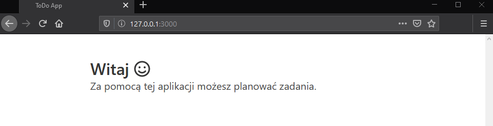
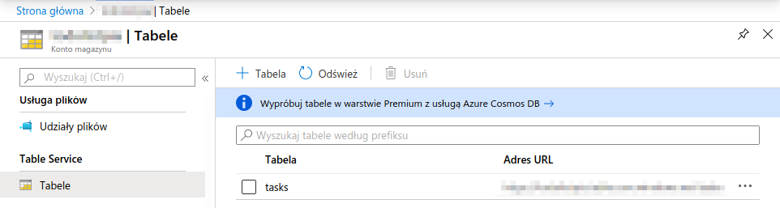
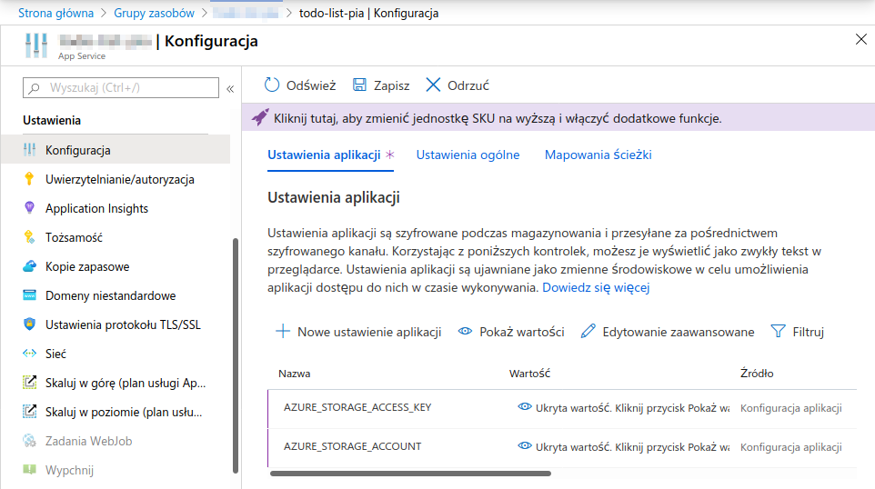
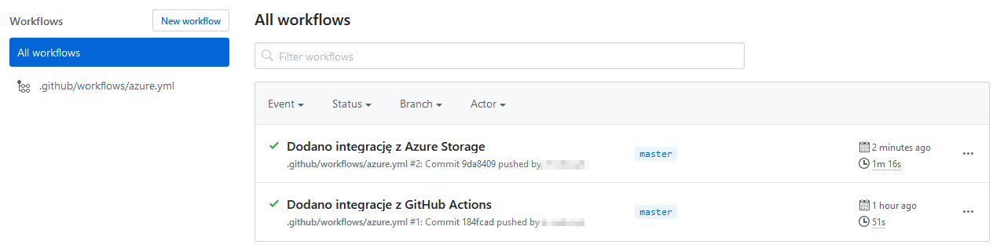

# Integracja aplikacji z usługą Azure Storage

## Wprowadzenie
Azure Storage to w pełni zarządzana usługa pamięci masowej dostępna na platformie Microsoft Azure. Składają się na nią następujące usługi:

* **Azure Blobs**: Usługa do przechowywania dużych zbiorów nieustrukturyzowanych danych, takich jak filmy, obrazy czy dźwięk.
* **Azure Tables**: Usługa NoSQL do przechowywania danych w tabelach typu klucz/wartość.
* **Azure Queues**: Usługa do przechowywania i pobierania dużej liczby wiadomości w kolejkach.
* **Azure Files**: Usługa do przechowywania i udostępniania plików oparta na protokole SMB (ang. Service Message Block).

Usługa Azure Storage wspiera różne metody zapewniania trwałości danych (ang. data redundancy):

* **Magazyn lokalnie nadmiarowy** (ang. locally redundant storage, LRS): Dane do zapisu replikowane są synchronicznie trzy razy w głównym regionie.
* **Magazyn strefowo nadmiarowy** (ang. zone redundant storage, ZRS): Dane do zapisu replikowane są synchronicznie w trzech strefach dostępności w głównym regionie.
* **Magazyn geograficznie nadmiarowy** (ang. geo redundant storage, GRS): Dane do zapisu replikowane są synchronicznie trzy razy w głównym regionie, a następnie kopiowane asynchronicznie do drugiego regionu. Ta metoda replikacji pomaga chronić dane w razie regionalnych awarii.
* **Magazyn geograficznie i strefowo nadmiarowy** (ang. geo-zone redundant storage, GZRS): Dane do zapisu replikowane są trzy razy w strefach dostępności w głównym regionie, a następnie kopiowane są asynchronicznie do drugiego regionu.

### Konto usługi Azure Storage
Do korzystania z usługi Azure Storage niezbędne jest utworzenie konta magazynu (ang. storage account). Jest to konto usługi Azure Storage, które zawiera wszystkie obiekty danych usługi Azure Storage: obiekty blob, pliki, kolejki, tabele i dyski; zapewnia unikatową przestrzeń nazw dla danych, które dostępne są za pośrednictwem protokołu HTTP/HTTPS. Azure udostępnia następujące rodzaje kont różniące się funkcjonalnościami i ceną:

* **General-purpose v2**: Podstawowe konto dla obiektów blob, plików, kolejek i tabel. Rekomendowane dla większości zastosowań usługi Azure Storage.
* **General-purpose v1**: Przedawnione konto dla obiektów blob, plików, kolejek i tabel.
* **BlockBlobStorage**: konto o zwiększonej wydajności dla obiektów typu blob. Zalecane dla scenariuszy z dużą liczbą transakcji.
* **FileStorage**: Konto wyłącznie dla plików o zwiększonej wydajności. Zalecane dla aplikacji typu enterprise i dla wysoce skalowalnych obciążeń.
* **BlobStorage**: Przedawnione konto dla obiektów typu blob.

Konto usługi Azure Storage można utworzyć w Azure Portal lub korzystając z narzędzi wiersza poleceń. Podczas tworzenia nowego konta wymagane jest podanie nazwy grupy zasobów, nazwy konta, regionu oraz warstwy cenowej. Do utworzenia nowego konta magazny służy polecenie `az storage account create`:

```sh
az storage account create \
  --resource-group <nazwa-grupy-zasobów> \
  --name <nazwa-konta> \
  --location <region> \
  --sku <warstwa-cenowa>
```

### Azure Tables
Usługa Azure Tables umożliwia przechowywanie danych typu klucz/wartość w ramach usługi Azure Storage. Azure Tables jest usługą typu NoSQL i nie wymaga definicji schematu danych. Dostęp do przechowywanych danych jest szybki i efektywny kosztowo.
 
Dane w tabelach przechowywane są jako kolekcje encji. Encje są podobne do wierszy. Każda encja składa się z klucza głównego oraz zestawu właściwości. Właściwość to para klucz/wartość, w której wartość jest silnie typowana. Encja może składać się z maksymalnie 255 właściwości, wliczając w to 3 właściwości systemowe:

* **PartitionKey**: Tabele są podzielone na partycje w celu obsługi równoważenia obciążenia między węzłami magazynowania. Elementy tabeli są uporządkowane według partycji. Partycja to kolejny zakres jednostek posiadających tę samą wartość klucza partycji. Klucz partycji jest unikalnym identyfikatorem partycji w danej tabeli, określonym przez właściwość `PartitionKey`. Klucz partycji stanowi pierwszą część klucza podstawowego encji. Klucz partycji może mieć wartość ciągu do 1 KB.
* **RowKey**: Druga część klucza podstawowego nazywana kluczem wiersza. Klucz wiersza jest unikalnym identyfikatorem jednostki w ramach danej partycji. `PartitionKey` i `RowKey` jednoznacznie identyfikują każdą encję w tabeli. Klucz wiersza to wartość ciągu, która może mieć maksymalnie 1 KB.
* **Timestamp**: To wartość typu `DateTime`, która jest utrzymywana po stronie serwera w celu zarejestrowania czasu ostatniej modyfikacji encji. Usługa tabel korzysta wewnętrznie z właściwości `Timestamp` w celu zapewnienia optymistycznej współbieżności. Wartość znacznika czasu jest monotonicznie rosnącą wartością, co oznacza, że za każdym razem, gdy element jest modyfikowany, wartość znacznika czasu wzrasta dla tego elementu. Tej właściwości nie należy ustawiać podczas operacji wstawiania lub aktualizacji (wartość zostanie zignorowana).

Właściwości systemowe są automatycznie tworzone dla każdej encji w tabeli. Nazwy tych właściwości są zastrzeżone, co oznacza, że nie mogą zostać zmienione. Programista odpowiedzialny jest za ustawienie wartości właściwości `PartitionKey` i `RowKey`.

### Praca z tabelami w wierszu poleceń
Do pracy z tabelami usługi Azure Storage w wierszu poleceń wykorzystuje się narzędzia pakietu Azure CLI. Do utworzenia nowej tabeli służy polecenie `az storage table create`:

```sh
az storage table create \
  --account-name <nazwa-konta> \
  --name <nazwa-tabeli>
```

Do wyświetlenia wszystkich tabel w obrębie konta magazynu służy polecenie `az storage table list`:

```sh
az storage table list \
  --account-name <nazwa-konta>
```

Do usunięcia tabeli o zadanej nazwie służy polecenie `az storage table delete`:

```sh
az storage table delete \
  --account-name <nazwa-konta> \
  --name <nazwa-tabeli>
```

### Praca z tabelami w Node.js
Do pracy z tabelami usługi Azure Storage wykorzystuje się moduł `azure-storage`:

```sh
npm install azure-storage
```

Po instalacji pakietu należy go zaimportować w pliku JavaScript:

```js
const storage = require('azure-storage')
```

Po zaimportowaniu modułu należy utworzyć instancję serwisu, który udostępnia metody do pracy z tabelami:

```js
const service = storage.createTableService()
```

Metoda `createTableService` wymaga podania poświadczeń konta magaznu. Można to zrobić na dwa sposoby. Pierwszy to przekazanie poświadczeń jako argumenty do metody. Jest to metoda dobra w przypadku testów, ale niezalecana przy wdrożeniach i przechowywaniu kodu w repozytoriach ze względu na uciążliwość w zarządzaniu poświadczeniami oraz bezpieczeństwo. Drugi sposób to ustawienie zmiennych środowiskowych `AZURE_STORAGE_ACCOUNT` i `AZURE_STORAGE_ACCESS_KEY`. W systemie Linux, zmienne środowiskowe można ustawić poleceniem `export`:

```sh
export <klucz>=<wartość>
```

Do pobrania poświadczeń konta (kluczy) służy polecenie `az storage account keys list`:

```sh
az storage account keys list \
  --resource-group <nazwa-grupy-zasobów> \
  --account-name <nazwa-konta> \
  --output table
```

Wykonanie powyższego polecenia wyświetli tabelę z dwoma kluczami `key1` i `key2`. Kolumna `Value` zawiera wartości kluczy. W przypadku braku poświadczeń, metoda `createTableService` rzuci wyjątek.

Posiadając instancję serwisu można utworzyć tabelę. Poniższy przykład tworzy tabelę o zadanej nazwie tylko w przypadku gdy taka tabela nie istnieje w obrębie danego konta magazynu:

```js
service.createTableIfNotExists('<nazwa-tabeli>', (error, result, response) => {})
```

Metoda oczekuje podania nazwy tabeli oraz funkcji, która zostanie wywołana gdy operacja się zakończy. Argument `error` to obiekt zawierający informacje o błędzie. W przypadku powodzenia wykonania operacji będzie on miał wartość `null`. Dodanie nowej encji do tabeli odbywa się za pomocą metody `insertEntity`. Poniższy przykład pokazuje jak za jej pomocą wstawić nową encję do zadanej tabeli:

```js
service.insertEntity('<nazwa-tabeli>', entity, (error, result, response) => {})
```

Argument `entity` to obiekt JavaScript określający właściwości encji do wstawienia. Oprócz właściwości zdefiniowanych przez użytkownika, musi on posiadać właściwości `PartitionKey` oraz `RowKey`. Poniższy przykład pokazuje jak utworzyć obiekt encji korzystając z obiektu pomocniczego `entityGenerator`:

```js
const generator = storage.TableUtilities.entityGenerator

const entity = {
  PartitionKey: generator.String('<klucz-partycji>'),
  RowKey: generator.String('<klucz-wiersza>'),
  ...
}
```

Do aktualizacji encji w tabeli służą metody `replaceEntity`, `mergeEntity`, `insertOrReplaceEntity`, `insertOrMergeEntity`. Poniższy przykład pokazuje jak zaktualizować właściwości encji identyfikowanej przez parę wartości `PartitionKey` i `RowKey`:

```js
service.replaceEntity('<nazwa-tabeli>', entity, (error, result, response) => {})
```

Argument `entity`, to podobnie jak w przypadku metody `insertEntity`, obiekt JavaScript. Oprócz właściwości zdefiniowanych przez użytkownika, musi on posiadać właściwości `PartitionKey` oraz `RowKey` identyfikujące encję, która zostanie zaktualizowana.

Do pobrania encji służy metoda `retrieveEntity`. Poniższy przykład pobiera wszystkie encje tabeli o zgodnie z zapytaniem przekazanym w argumencie `query`:

```js
service.queryEntities('<nazwa-tabeli>', query, null, (error, result, response) => {})
```

Argument `result.entities` będzie zawierać listę encji pobranych z tabeli. Poniższy przykład buduje zapytanie, które zwróci wszystkie encje których wartość właściwości `PartitionKey` jest równa łańcuchowi znaków `<wartość>`:

```js
const query = new storage.TableQuery().where('PartitionKey eq ?', '<wartość>')
```

Do usunięcia encji służy metoda `deleteEntity`:

```js
service.deleteEntity('<nazwa-tabeli>', entity, (error, response) => {})
```

Argument `entity` to obiekt JavaScript, który musi zawierać parę `PartitionKey` oraz `RowKey` identyfikującą encję do usunięcia:

```js
const entity = {
  PartitionKey: generator.String('<klucz-partycji>'),
  RowKey: generator.String('<klucz-wiersza>')
}
```

Do usunięcia tabeli służy metoda `deleteTable`:

```js
service.deleteTable('<nazwa-tabeli>', (error, response) => {})
```

Dodatkowe materiały:

* [Dokumentacja modułu azure-storage](https://docs.microsoft.com/en-us/azure/cosmos-db/table-storage-how-to-use-nodejs?toc=https%3A%2F%2Fdocs.microsoft.com%2Fen-us%2Fazure%2Fstorage%2Ftables%2Ftoc.json&bc=https%3A%2F%2Fdocs.microsoft.com%2Fen-us%2Fazure%2Fbread%2Ftoc.json)

## Zadanie 1
Utwórz nowe konto magazynu. Połącz aplikację z utworzonym kontem korzystając z modułu `azure-storage`. W kodzie aplikacji utwórz tabelę o nazwie `tasks`. Wszystkie zmiany zatwierdź w repozytorium z komunikatem "Dodano integrację z Azure Storage" i wypchnij do serwisu GitHub.

1. Zainstaluj moduł `azure-storage`:

```sh
npm install --save azure-storage
```

2. Utwórz plik `store.js` i dodaj następujący kod:

```js
const storage = require('azure-storage')
const service = storage.createTableService()
const table = 'tasks'

const init = async () => (
  new Promise((resolve, reject) => {
    service.createTableIfNotExists(table, (error, result, response) => {
      !error ? resolve() : reject()
    })
  })
)

module.exports = {
  init
}
```

3. W pliku `server/index.js` dodaj następujący kod:

```js
require('./store').init()
```

4. Utwórz konto magazynu w tej samej grupie zasobów co aplikacja:

```sh
az storage account create --resource-group <nazwa-grupy-zasobów> --name <nazwa-magazynu> --location westeurope --sku Standard_LRS
```

5. Pobierz i wyświetl listę poświadczeń konta magazynu:

```sh
az storage account keys list --resource-group <nazwa-grupy-zasobów> --account-name <konto-magazynu> --output table
```

6. Ustaw zmienną środowiskową z nazwą konta magazynu:

```sh
export AZURE_STORAGE_ACCOUNT=<nazwa-konta>
```

7. Ustaw zmienną środowiskową z kluczem konta magazynu:

```sh
export AZURE_STORAGE_ACCESS_KEY=<klucz>
```

Wartość klucza znajdziesz w tabeli w kolumnie `Value` z kroku nr 5.

8. Uruchom aplikację:

```sh
npm run start
```

Przejdź pod adres [http://127.0.0.1:3000](http://127.0.0.1:3000) i sprawdź jej działanie.



9. Przejdź do konta magazynu w [Azure Portal](https://portal.azure.com) a następnie do zakładki *Tabele*. sprawdź czy tabela o nazwie `tasks` została utworzona.



10. Zatrzymaj aplikację kombinacją klawiszy `ctrl+c` a następnie usuń tabelę klikając przycisk *...* i wybierając z menu *Usuń*.

11. Przejdź do aplikacji App Service w [Azure Portal](https://portal.azure.com) a następnie do zakładki *Konfiguracja*. Klikając przycisk *Nowe stawienie aplikacji* dodaj dwa ustawienia `AZURE_STORAGE_ACCOUNT` i `AZURE_STORAGE_ACCESS_KEY`. Ich wartości ustaw tak samo jak w przypadku zmiennych środowiskowych w krokach 6 i 7.



Po zakończeniu kliknij przycisk *Zapisz*.

12. Dodaj pliki:

```sh
git add --all
```

13. Zatwierdź zmiany w repozytorium:

```sh
git commit -m "Dodano integrację z Azure Storage"
```

14. Wypchnij zmiany do repozytorium w serwisie GitHub:

```sh
git push origin master
```

15. Przejdź do zakładki **Actions** na stronie repozytorium GitHub i poczekaj aż wdrożenie zakończy się powodzeniem:



Następnie otwórz aplikację w przeglądarce przechodząc pod adres `http://<nazwa-aplikacji>.azurewebsites.net` i sprawdź czy działa tak samo jak uruchomiona lokalnie.

16. Ponownie przejdź do konta magazynu w [Azure Portal](https://portal.azure.com) a następnie do zakładki *Tabele*. sprawdź czy tabela o nazwie `tasks` została ponownie utworzona.


## Zadanie 2
Zaimplementuj ponawianie operacji na tabeli w przypadku niepowodzenia korzystając z dowolnego z dostarczonych wraz z modułem `azure-storage` filtra. Przykład użycia takie filtra znajdziesz w [dokumentacji usługi w sekcji filters](https://docs.microsoft.com/en-us/azure/cosmos-db/table-storage-how-to-use-nodejs?toc=https%3A%2F%2Fdocs.microsoft.com%2Fen-us%2Fazure%2Fstorage%2Ftables%2Ftoc.json&bc=https%3A%2F%2Fdocs.microsoft.com%2Fen-us%2Fazure%2Fbread%2Ftoc.json). Wszystkie zmiany zatwierdź w repozytorium z komunikatem "Dodano ponawianie operacji na tabeli" i wypchnij do serwisu GitHub.

## Zadanie 3
Zaimplementuj logowanie na konsolę operacji na tabeli. Do tego celu napisz swój własny filtr na wzór filtru ponawiania operacji. Do logowania na konsoli wykorzystaj metodę `console.log`. Szkielet funkcji filtrującej, który możesz wykorzystać jako bazę:

```js
function LoggingFilter() {
  this.handle = (requestOptions, next) => {
    // ...
    next(requestOptions, (returnObject, finalCallback, next) => {
      // ...
    })
  }
}
```

Wszystkie zmiany zatwierdź w repozytorium z komunikatem "Dodano logowanie operacji na tabeli" i wypchnij do serwisu GitHub.