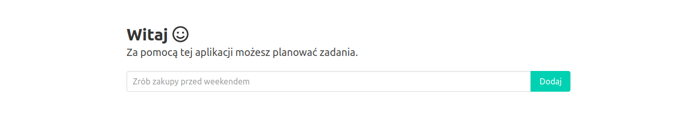
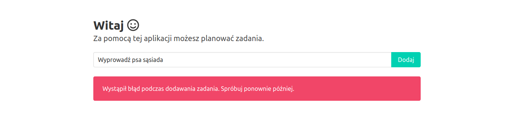
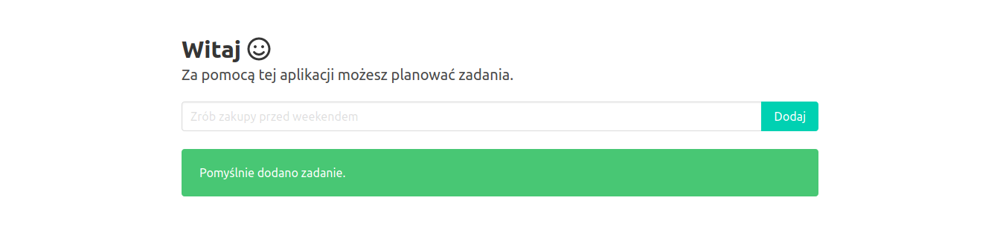
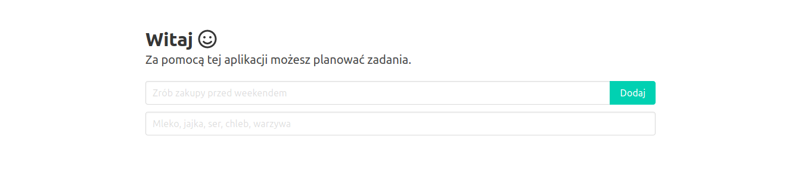
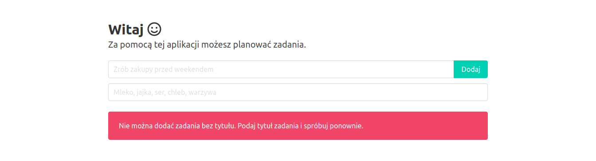

# Dodawanie zadań do listy

## Wprowadzenie

Dodatkowe materiały:
* [Fetch API](https://developer.mozilla.org/en-US/docs/Web/API/Fetch_API/Using_Fetch)
* [Dokumentacja body-parser](https://github.com/koajs/bodyparser)
* [Dokumentacja UUID](https://github.com/uuidjs/uuid)

## Zadanie 1
Dodaj funkcję dodawania zadań. Na stronie głównej umieść pole tekstowe pozwalające na podanie tytułu oraz przycisk umożliwiający dodanie zadania. Po kliknięciu przycisku wyświetl użytkownikowi komunikat z informacją o błędzie albo powodzeniu operacji. Wszystkie zmiany zatwierdź w repozytorium z komunikatem "Zaimplementowano funkcję dodawania zadań" i wypchnij do serwisu GitHub.

1. Dodaj formularz na stronie głównej.

W pliku `client/index.html` dodaj nowy wiersz i kolumnę z formularzem do obsługi dodawania zadań (pod tekstem powitalnym):

```html
<div class="columns is-centered">
  <div class="column is-8">
    <form class="form" id="addTaskForm" name="addTaskForm">
      <div class="field has-addons">
        <div class="control is-expanded">
          <input class="input" type="text" name="title" id="title" placeholder="Zrób zakupy przed weekendem">
        </div>
        <div class="control">
          <button class="button is-primary" type="submit" id="addTaskBtn">
            Dodaj
          </button>
        </div>
      </div>
    </form>
  </div>
</div>
```

Pod formularzem dodaj nowy wiersz i kolumnę gdzie będzie wyświetlany komunikat dla użytkownika:

```html
<div class="columns is-centered">
  <div class="column is-8">
    <div class="notification is-hidden is-light" id="addTaskMsg"></div>
  </div>
</div>
```

2. Zaimplementuj obsługę formularza dodawania zadań:

W pliku `client/index.js` dodaj kod obsługujący formularz:

```js
const addTaskForm = document.querySelector('#addTaskForm')
const addTaskTitle = document.querySelector('#addTaskForm #title')
const addTaskBtn = document.querySelector('#addTaskBtn')
const addTaskMsg = document.querySelector('#addTaskMsg')

const addTask = async () => {
  const data = new FormData(addTaskForm)

  const headers = new Headers({
    'Content-Type': 'application/json; charset=utf-8'
  })

  const body = JSON.stringify({
    title: data.get('title'),
    description: data.get('description')
  })

  return await fetch('/api/tasks', { method: 'POST', headers, body })
}

addTaskForm.addEventListener('submit', (event) => {
  event.preventDefault()

  addTaskBtn.classList.add('is-loading', 'is-disabled')
  addTaskMsg.classList.remove('is-danger', 'is-success')
  addTaskMsg.classList.add('is-hidden')

  setTimeout(() => {
    addTask()
      .then((response) => {
        if (!response.ok) {
          throw Error('Wystąpił błąd podczas dodawania zadania. Spróbuj ponownie później.')
        }

        addTaskMsg.textContent = 'Pomyślnie dodano zadanie.'
        addTaskMsg.classList.add('is-success')
        addTaskTitle.value = ''
      })
      .catch((error) => {
        addTaskMsg.textContent = error.message
        addTaskMsg.classList.add('is-danger')
      })
      .finally(() => {
        addTaskBtn.classList.remove('is-loading', 'is-disabled')
        addTaskMsg.classList.remove('is-hidden')
      })
  }, 1000)    
})
```

3. Przetestuj aplikację lokalnie.

Uruchom aplikację poleceniem `npm run start`. Przejdź pod adres [http://127.0.0.1:3000](http://127.0.0.1:3000) i sprawdź czy aplikacja wyświetla poprawnie formularz:



Wpisz dowolny tytuł zadania i kliknij przycisk *Dodaj*. Sprawdź czy wyświetli się komunikat informujący o błędzie:



Zatrzymaj aplikację kombinacją klawiszy `ctrl+c`.

4. Dodaj middleware odpowiedzialny za parsowanie treści żądań HTTP.

Zainstaluj moduł `koa-bodyparser`:

```sh
npm install --save koa-bodyparser
```

W pliku `server/index.js` zaimportuj moduł `koa-bodyparser`:

```js
const parse = require('koa-bodyparser')
```

Użyj middleware po serwowaniu statycznych plików, a przed obsługą metod REST:

```js
app.use(parse())
```

5. Zaimplementuj funkcję odpowiedzialną za dodawanie zadań do tabeli Azure Tables.

Zainstaluj moduł `uuid`:

```sh
npm install --save uuid
```

W pliku `server/store.js` zaimportuj moduł `uuid`:

```js
const uuid = require('uuid')
```

Stwórz funkcję `addTask` z następująca implementacją:

```js
const addTask = async ({ title }) => (
  new Promise((resolve, reject) => {
    const gen = storage.TableUtilities.entityGenerator
    const task = {
      PartitionKey: gen.String('task'),
      RowKey: gen.String(uuid.v4()),
      title
    }

    service.insertEntity(table, task, (error) => {
      !error ? resolve() : reject()
    })
  })
)
```

Wyeksportuj funkcję `addTask` dodając jej nazwę do `module.exports`.

6. Zaimplementuj metodę REST odpowiedzialną za obsługę żądań dodania zadań.

W pliku `server/routes/tasks.js` zaimportuj moduł `store.js`:

```js
const store = require('../store')
```

Zmień implementację trasy odpowiedzialnej za dodawanie zadań:

```js
router.post('/', async (ctx) => {
  await store.addTask(ctx.request.body)
  ctx.status = 200
})
```

7. Uruchom aplikację ponownie i sprawdź czy po dodaniu nowego zadania wyświetli się komunikat o powodzeniu operacji:



Zatrzymaj aplikację kombinacją klawiszy `ctrl+c`.

8. Dodaj zmiany:

```sh
git add --all
```

9. Zatwierdź zmiany w repozytorium:

```sh
git commit -m "Dodano funkcję dodawania zadań"
```

10. Wypchnij zmiany do repozytorium w serwisie GitHub:

```sh
git push origin master
```
11. Po wdrożeniu przetestuj aplikację przechodząc pod adres `http://<nazwa-aplikacji>.azurewebsites.net`.

## Zadanie 2
Dodaj funkcję umożliwiającą użytkownikowi podanie opisu zadania. Na stronie głównej w formularzu dodawania zadania umieść nowe pole, w którym użytkownik będzie mógł podać opis zadania. Opis zadania powinien być zapisywany w tabeli `tasks` razem z tytułem. Wszystkie zmiany zatwierdź w repozytorium z komunikatem "Dodano możliwość opisania zadania" i wypchnij do serwisu GitHub.



## Zadanie 3
Dodaj sprawdzanie poprawności wprowadzonych przez użytkownika danych. W przypadku nie podania tytułu zadania wyświetl komunikat informujący o błędzie. Sprawdzanie poprawności powinno odbywać się po stronie serwera. Wszystkie zmiany zatwierdź w repozytorium z komunikatem "Dodano weryfikację danych wprowadzonych przez użytkownika" i wypchnij do serwisu GitHub.

