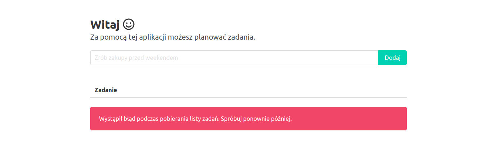
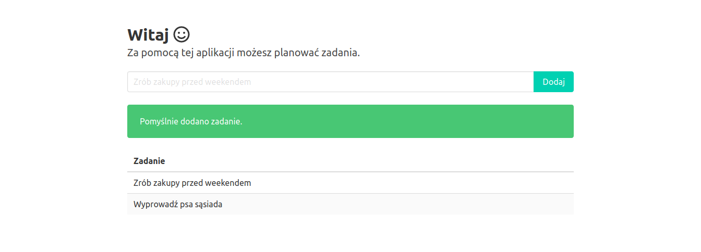
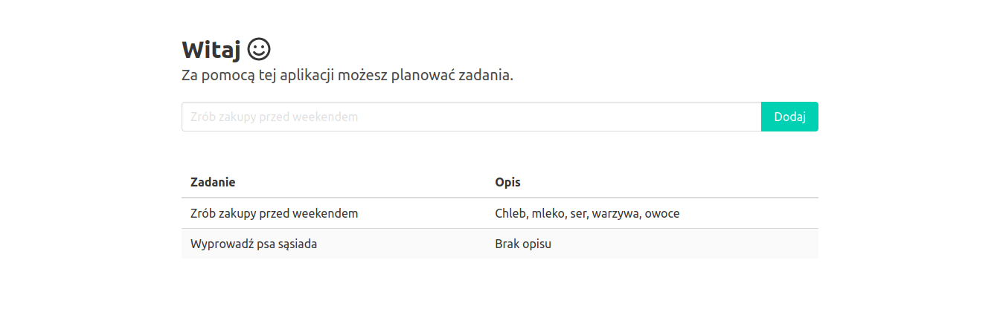
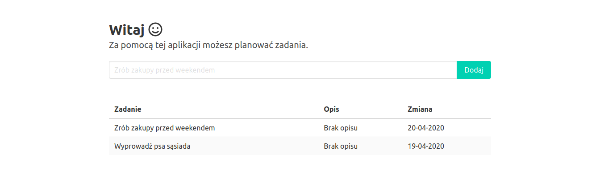

# Wyświetlanie listy zadań

## Zadanie 1
Dodaj funkcję wyświetlania zadań dodanych przez użytkownika. Na stronie głównej umieść tabelę, w której wyświetlany będzie tytuł zadania. W przypadku gdy niemożliwe będzie pobranie listy zadań, wyświetlony zostanie komunikat o błędzie. Wszystkie zmiany zatwierdź w repozytorium z komunikatem "Zaimplementowano wyświetlanie listy zadań" i wypchnij do serwisu GitHub.

1. Dodaj tabelę, w której wyświetlane będą zadania.

W pliku `client/index.html` dodaj wiersz z kolumną i tabelą:

```html
<div class="columns is-centered">
  <div class="column is-8">
    <table class="table is-fullwidth is-striped">
      <thead>
        <tr>
          <th>Zadanie</th>
        </tr>
      </thead>
      <tbody id="tasksList">
      </tbody>
    </table>
  </div>
</div>
```

Dodaj kolejny wiersz z kolumną i miejscem na komunikat informujący o błędzie pobierania listy zadań:

```html
<div class="columns is-centered">
  <div class="column is-8">
    <div class="notification is-hidden is-light" id="tasksListMsg"></div>
  </div>
</div>
```

2. Zaimplementuj pobieranie listy zadań.

W pliku `client/index.js` dodaj kod pobierający listę zadań:

```js
const tasksList = document.querySelector('#tasksList')
const tasksListMsg = document.querySelector('#tasksListMsg')

const listTasks = async () => {
  tasksList.innerHTML = ''
  tasksListMsg.classList.remove('is-danger')
  tasksListMsg.classList.add('is-hidden')

  fetch('/api/tasks')
    .then((response) => {
      if (!response.ok) {
        throw Error(response.statusText)
      }

      return response.json()
    })
    .then((response) => {
      response.forEach((task) => {
        const title = document.createElement('td')
        title.innerHTML = `<p>${task.title}</p>`

        const row = document.createElement('tr')
        row.appendChild(title)

        tasksList.appendChild(row)
      })
    })
    .catch(() => {
      tasksListMsg.textContent = 'Wystąpił błąd podczas pobierania listy zadań. Spróbuj ponownie później.'
      tasksListMsg.classList.add('is-danger')
    })
}

listTasks()
```

Zmodyfikuj funkcję dodawania zadań tak, aby po dodaniu zadania lista została odświeżona:

```js
setTimeout(() => {
  addTask()
    .then((response) => {
      if (!response.ok) {
        throw Error(response.statusText)
      }

      addTaskMsg.textContent = 'Pomyślnie dodano zadanie.'
      addTaskMsg.classList.add('is-success')
      addTaskTitle.value = ''

      listTasks()
    })
    .catch(() => {
      addTaskMsg.textContent = 'Wystąpił błąd podczas dodawania zadania. Spróbuj ponownie później.'
      addTaskMsg.classList.add('is-danger')
    })
    .finally(() => {
      addTaskBtn.classList.remove('is-loading', 'is-disabled')
      addTaskMsg.classList.remove('is-hidden')
    })
}, 1000)
```

3. Przetestuj aplikację lokalnie.

Uruchom aplikację poleceniem `npm run start`. Przejdź pod adres [http://127.0.0.1:3000](http://127.0.0.1:3000) i sprawdź czy został wyświetlony komunikat o błędzie pobierania listy zadań:



Zatrzymaj aplikację kombinacją klawiszy `ctrl+c`.

4. Zaimplementuj funkcję pobierania listy zadań z tabeli.

W pliku `store.js` dodaj funkcję `listTasks`:

```js
const listTasks = async () => (
  new Promise((resolve, reject) => {
    const query = new storage.TableQuery()
      .select(['title'])
      .where('PartitionKey eq ?', 'task')

    service.queryEntities(table, query, null, (error, result) => {
      !error ? resolve(result.entries.map((entry) => ({
        title: entry.title._
      }))) : reject()
    })
  })
)
```

Wyeksportuj funkcję `listTasks` dodając jej nazwę do `module.exports`.

5. Zaimplementuj metodę REST odpowiedzialną za obsługę żądań pobierania listy zadań.

W pliku `routes/tasks.js` zmień implementację trasy odpowiedzialnej za pobieranie listy zadań:

```js
router.get('/', async (ctx) => {
  ctx.response.body = await store.listTasks()
})
```

6. Przetestuj aplikację lokalnie.

Uruchom aplikację ponownie i sprawdź czy lista zadań wyświetla się po załadowaniu strony. Spróbuj dodać kilka zadań i sprawdź czy lista odświeża się po dodaniu każdego z nich:



Zatrzymaj aplikację kombinacją klawiszy `ctrl+c`.

7. Dodaj zmiany:

```sh
git add --all
```

8. Zatwierdź zmiany w repozytorium:

```sh
git commit -m "Dodano funkcję wyświetlania listy zadań"
```

9. Wypchnij zmiany do repozytorium w serwisie GitHub:

```sh
git push origin master
```

10. Po wdrożeniu przetestuj aplikację przechodząc pod adres `http://<nazwa-aplikacji>.azurewebsites.net`.

## Zadanie 2
Dodaj kolumnę do tabeli, w której wyświetlany będzie opis zadania. W przypadku gdy opis nie został dodany, wyświetl zamiast niego tekst *Brak opisu*. Wszystkie zmiany zatwierdź w repozytorium z komunikatem "Dodano wyświetlanie opisu na liście zadań" i wypchnij do serwisu GitHub.



## Zadanie 3
Dodaj kolumnę do tabeli, w której wyświetlana będzie data ostatniej modyfikacji zadania. Do formatowania daty i czasu możesz wykorzystać bibliotekę [moment](https://www.npmjs.com/package/moment). Do pobrania ostatniego czasu modyfikacji wykorzystaj właściwość systemową `Timestamp`. Wszystkie zmiany zatwierdź w repozytorium z komunikatem "Dodano wyświetlanie daty ostatniej modyfikacji na liście zadań" i wypchnij do serwisu GitHub.

