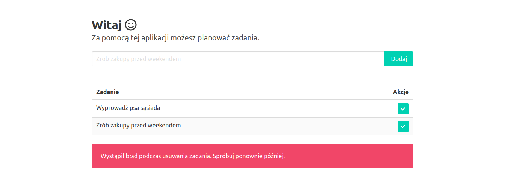
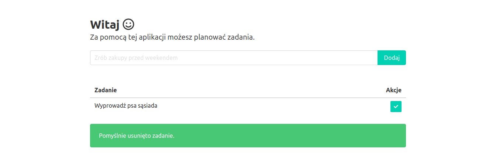
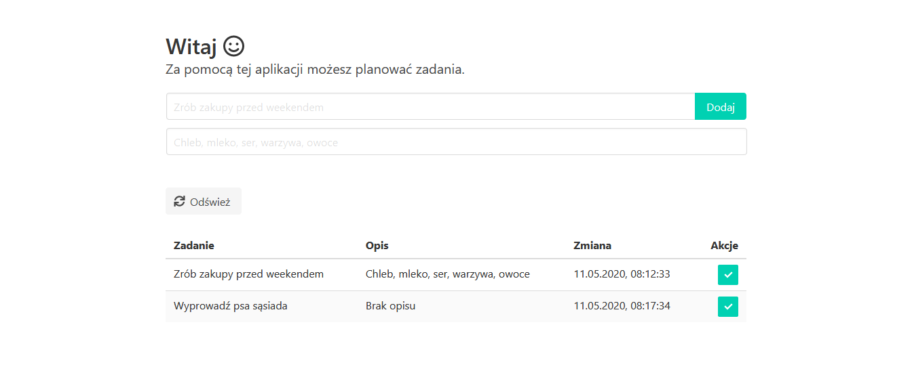
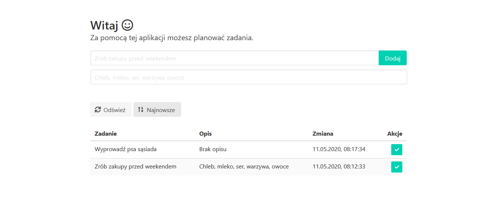

# Zmiana statusu zadań

## Zadanie 1
Dodaj kolumnę do tabeli, w której wyświetlany będzie przycisk umożliwiający użytkownikowi zakończenie zadania. Po kliknięciu zadanie zostanie usunięte z tabeli oraz listy. Wszystkie zmiany zatwierdź w repozytorium z komunikatem "Zaimplementowano funkcję usuwania zadań" i wypchnij do serwisu GitHub.

1. Dodaj kolumnę, w której wyświetlany będzie przycisk.

W pliku `client/index.html` zmień kod tabeli na następujący:

```html
<table class="table is-fullwidth is-striped">
  <thead>
    <tr>
      <th>Zadanie</th>
      <th class="has-text-right">Akcje</th>
    </tr>
  </thead>
  <tbody id="tasksList">
  </tbody>
</table>
```

2. Dodaj przycisk do zmiany statusu zadania.

W pliku `client/index.js` zmodyfikuj część odpowiedzialną za budowanie listy tak, aby dodawała do każdej pozycji przycisk:

```js
const listTasks = async () => {
  tasksList.innerHTML = ''
  tasksListMsg.classList.remove('is-danger')
  tasksListMsg.classList.add('is-hidden')

  fetch('/api/tasks')
    .then((response) => {
      if (!response.ok) {
        throw Error(response.statusText)
      }

      return response.json()
    })
    .then((response) => {
      response.forEach((task) => {
        const title = document.createElement('td')
        title.innerHTML = `<p>${task.title}</p>`

        const actions = document.createElement('td')
        actions.classList.add('has-text-right')
        actions.innerHTML = `<button class="button is-small is-primary" id="deleteTask${task.id}" onclick="completeTask('${task.id}');"><span class="icon is-small"><i class="fas fa-check"></i></span></button>`

        const row = document.createElement('tr')
        row.appendChild(title)
        row.appendChild(actions)

        tasksList.appendChild(row)
      })
    })
    .catch(() => {
      tasksListMsg.textContent = 'Wystąpił błąd podczas pobierania listy zadań. Spróbuj ponownie później.'
      tasksListMsg.classList.add('is-danger')
    })
}
```

Dodaj implementację funkcji usuwającej zadania:

```js
const completeTask = (id) => {
  tasksListMsg.classList.remove('is-danger')
  tasksListMsg.classList.add('is-hidden')

  const button = document.querySelector(`#deleteTask${id}`)
  button.classList.add('is-loading')

  setTimeout(() => {
    fetch(`/api/tasks?id=${id}`, { method: 'DELETE' })
      .then((response) => {
        if (!response.ok) {
          throw Error(response.statusText)
        }

        tasksListMsg.textContent = 'Pomyślnie usunięto zadanie.'
        tasksListMsg.classList.add('is-success')

        listTasks()
      })
      .catch(() => {
        button.classList.remove('is-loading')
        tasksListMsg.textContent = 'Wystąpił błąd podczas usuwania zadania. Spróbuj ponownie później.'
        tasksListMsg.classList.add('is-danger')
      })
      .finally(() => {
        tasksListMsg.classList.remove('is-hidden')
      })
  }, 1000)
}
```

3. Przetestuj aplikację lokalnie.

Uruchom aplikację poleceniem `npm run start`. Przejdź pod adres [http://127.0.0.1:3000](http://127.0.0.1:3000). Spróbuj usunąć zadanie i sprawdź czy został wyświetlony komunikat o błędzie:



Zatrzymaj aplikację kombinacją klawiszy `ctrl+c`.

4. Zaimplementuj funkcję usuwania danych z tabeli.

W pliku `store.js` dodaj funkcję `deleteTask` odpowiedzialną za usuwanie zadań:

```js
const deleteTask = async ({ id }) => (
  new Promise((resolve, reject) => {
    const gen = storage.TableUtilities.entityGenerator
    const task = {
      PartitionKey: gen.String('task'),
      RowKey: gen.String(id)
    }

    service.deleteEntity(table, task, (error) => {
      !error ? resolve() : reject()
    })
  })
)
```

Wyeksportuj funkcję `deleteTask` dodając jej nazwę do `module.exports`.

Zmień implementację funkcji zwracającej listę zadań tak, aby w rezultacie zawarte było pole identyfikujące zadanie:

```js
const listTasks = async () => (
  new Promise((resolve, reject) => {
    const query = new storage.TableQuery()
      .select(['RowKey', 'title'])
      .where('PartitionKey eq ?', 'task')

    service.queryEntities(table, query, null, (error, result) => {
      !error ? resolve(result.entries.map((entry) => ({
        id: entry.RowKey._,
        title: entry.title._
      }))) : reject()
    })
  })
)

```

5. Zaimplementuj metodę REST odpowiedzialną za obsługę żądań usuwania zadań.

W pliku `routes/tasks.js` zamień implementację trasy odpowiedzialnej za usuwanie zadań:

```js
router.delete('/', async (ctx) => {
  await store.deleteTask(ctx.request.query)
  ctx.status = 200
})
```

6. Przetestuj aplikację lokalnie.

Uruchom aplikację ponownie i sprawdź czy zadania usuwają się poprawnie:



Zatrzymaj aplikację kombinacją klawiszy `ctrl+c`.

7. Dodaj zmiany:

```sh
git add --all
```

8. Zatwierdź zmiany w repozytorium:

```sh
git commit -m "Dodano przycisk zmiany statusu zadania"
```

9. Wypchnij zmiany do repozytorium w serwisie GitHub:

```sh
git push origin master
```

10. Po wdrożeniu przetestuj aplikację przechodząc pod adres `http://<nazwa-aplikacji>.azurewebsites.net`.

## Zadanie 2
Dodaj przycisk umożliwiający użytkownikowi odświeżanie listy zadań bez przeładowania całej strony. Przycisk umieść nad listą zadań. Do odświeżania listy wykorzystaj już istniejącą funkcję `listTasks`. Wszystkie zmiany zatwierdź w repozytorium z komunikatem "Dodano przycisk do odświeżania listy zadań" i wypchnij do serwisu GitHub.



## Zadanie 3
Dodaj przycisk umożliwiający użytkownikowi zmianę kolejności wyświetlania zdań. Na kliknięcie przycisku, zadania powinny posortować się od najnowszego do najstarszego, a przycisk powinien się podświetlić. Po ponownym kliknięciu, zadania powinny posortować się od najstarszego do najnowszego, a podświetlenie powinno zniknąć z przycisku. Przycisk umieść obok przycisku odświeżania listy. Do pobrania czasu wykorzystaj właściwość systemową `Timestamp`. Wszystkie zmiany zatwierdź w repozytorium z komunikatem "Dodano przycisk do sortowania" i wypchnij do serwisu GitHub.

